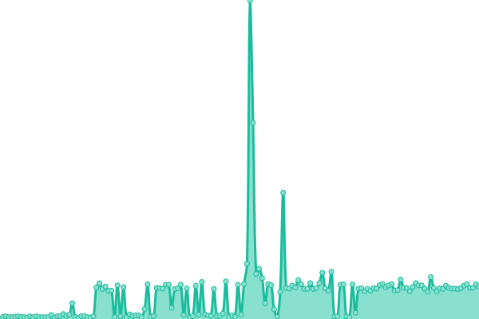
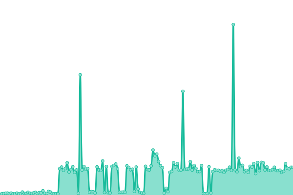
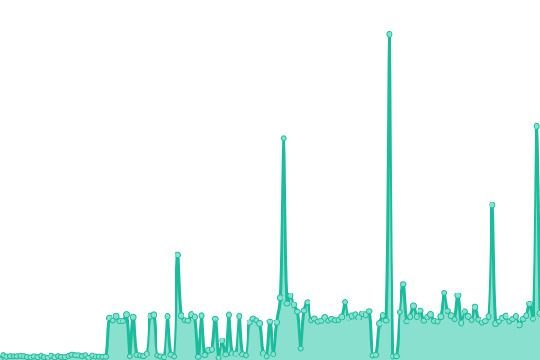
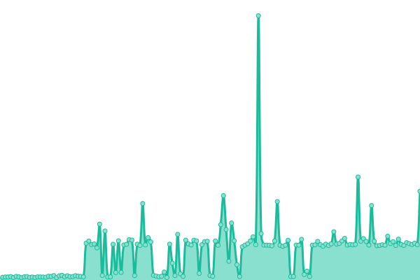
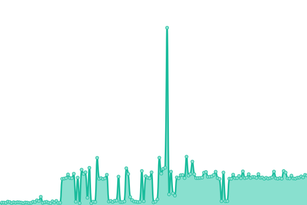

# [📈 Live Status](https://status.digitalidsystem.gov.au): <!--live status--> **🟩 All systems operational**

This repository contains the open-source uptime monitor and status page for [Digital ID System](https://digitalidsystem.gov.au/), powered by [Upptime](https://github.com/upptime/upptime).

With [Upptime](https://upptime.js.org), you can get your own unlimited and free uptime monitor and status page, powered entirely by a GitHub repository. We use [Issues](https://github.com/DigitalIDSystem/regulator-status/issues) as incident reports, [Actions](https://github.com/DigitalIDSystem/regulator-status/actions) as uptime monitors, and [Pages](https://status.digitalidsystem.gov.au) for the status page.

<!--start: status pages-->
<!-- This summary is generated by Upptime (https://github.com/upptime/upptime) -->
<!-- Do not edit this manually, your changes will be overwritten -->
<!-- prettier-ignore -->
| URL | Status | History | Response Time | Uptime |
| --- | ------ | ------- | ------------- | ------ |
|  [Accredited Entities Register](https://accreditation.register.digitalidsystem.gov.au/) | 🟩 Up | [accredited-entities-register.yml](https://github.com/DigitalIDSystem/regulator-status/commits/HEAD/history/accredited-entities-register.yml) | 

 590ms
     
 | 

<a href="https://status.digitalidsystem.gov.au/history/accredited-entities-register">100.00%</a>
    

|  [Australian Government Digital ID System Register](https://agdis.register.digitalidsystem.gov.au/) | 🟩 Up | [australian-government-digital-id-system-register.yml](https://github.com/DigitalIDSystem/regulator-status/commits/HEAD/history/australian-government-digital-id-system-register.yml) | 

 566ms
     
 | 

<a href="https://status.digitalidsystem.gov.au/history/australian-government-digital-id-system-register">100.00%</a>
    

|  [Management API](https://manage.api.digitalidsystem.gov.au/v1/health) | 🟩 Up | [management-api.yml](https://github.com/DigitalIDSystem/regulator-status/commits/HEAD/history/management-api.yml) | 

 614ms
     
 | 

<a href="https://status.digitalidsystem.gov.au/history/management-api">100.00%</a>
    

|  [Accredited Entities Register API](https://register.api.digitalidsystem.gov.au/accredited-entities/v1/health) | 🟩 Up | [accredited-entities-register-api.yml](https://github.com/DigitalIDSystem/regulator-status/commits/HEAD/history/accredited-entities-register-api.yml) | 

 559ms
     
 | 

<a href="https://status.digitalidsystem.gov.au/history/accredited-entities-register-api">100.00%</a>
    

|  [Australian Government Digital ID System Register API](https://register.api.digitalidsystem.gov.au/agdis/v1/health) | 🟩 Up | [australian-government-digital-id-system-register-api.yml](https://github.com/DigitalIDSystem/regulator-status/commits/HEAD/history/australian-government-digital-id-system-register-api.yml) | 

 593ms
     
 | 

<a href="https://status.digitalidsystem.gov.au/history/australian-government-digital-id-system-register-api">100.00%</a>
    

<!--end: status pages-->

[**Visit our status website →**](https://status.digitalidsystem.gov.au)

## 📄 License

- Powered by: [Upptime](https://github.com/upptime/upptime)
- Code: [MIT](./LICENSE) © [Anand Chowdhary](https://anandchowdhary.com), supported by [Pabio](https://pabio.com)
- Data in the `./history` directory: [Open Database License](https://opendatacommons.org/licenses/odbl/1-0/)
